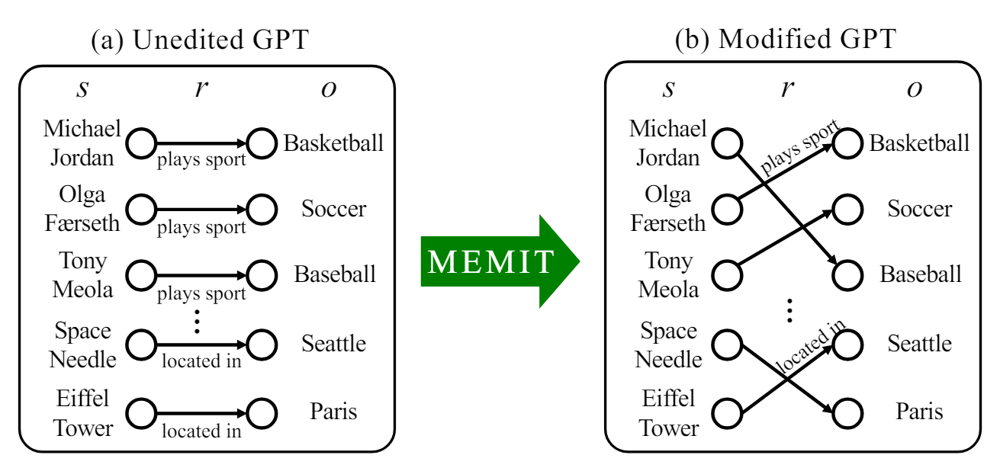

# **Is Bigger Edit Batch Size Always Better? - An Empirical Study on Model Editing with Llama-3**
*Authors: Junsang Yoon, Akshat Gupta, Gopala Anumanchipalli*

## Background
### What is __model editing__?

   

  Fig 1. Concept of model editing.[Editing Large Language Models: Problems, Methods, and Opportunities](https://arxiv.org/pdf/2305.13172)

The rapidly evolving field of artificial intelligence faces the challenge of keeping large language models (LLMs) up-to-date with new information, as traditional retraining methods are time-consuming and resource-intensive. As shown in figure, an alternative is __model editing__ proposed in [(Sinitsin et al., 2020)](https://openreview.net/pdf?id=HJedXaEtvS). It enables data-efficient alterations to the behavior of models.

  

  Fig 2. Example of model editing in case of MEMIT.

Model editing modifies stored facts within a model and corrects inaccuracies without retraining. Techniques such as __ROME__ (Rank-One Model Editing) [(Meng et al., 2022a)](https://arxiv.org/pdf/2202.05262), __MEMIT__ (Mass Editing Memory in Transformer) [(Meng et al., 2022b)](https://arxiv.org/pdf/2210.07229), and __EMMET__ (Equality-constrained Mass Model Editing algorithm for Transformers) [(Gupta et al., 2024)](https://arxiv.org/pdf/2401.07453), known as "locate-and-edit" algorithms, have emerged to optimize the preservation-memorization (PM) objective. These methods __directly modify__ specific areas of the model and are applicable to any transformer-based LLMs, offering a more efficient way to update models without retraining.

### How model editing works?
For a relation __(s, r, o)__ expressed as a tuple in the form of __(subject, relation, object)__. In model editing, we aim to update the memory of the existing model with new facts by learning about a new object __(s, r, o*)__. Model editing directly reform the weight by objective function, called the preservation-memorization objective. This objective consists of two parts, a __preservation term__ and a __memorization term__. Below equation shows how ROME works with preservation term and memorization term.

  
    \operatorname{argmin}_{\hat{W}} =\alpha \cdot X W
   

    
### How model editing performance is estimated?
Model performance is estimated with 4 main scores, and they are denoted as follow.
#### __Efficacy Score (ES)__ 
It measures if the new fact, we want to edit, is successfully edited to model. It is measured by percentage where P(new fact) > P(old fact) for query prompt.

#### __Paraphrase Score (PS)__
It measures model's ability to generalize following an edit. It is measured by where P(new fact) > P(old fact) under paraphrases of the query prompt.

#### __Neighborhood Score (NS)__
It represents the locality of model editing. It measures the impact of edit process on adjacent stored facts within the model. It quantifies the percentage of nearby facts that remain unchanged after edit.

#### __Composite Score (S)__
It combines aspect of edit success, generalization, and locality. It is calculated as the harmonic mean of Edit Success (ES), Paraphrase Score (PS), and Neighborhood Score (NS). It provies overall efficacy of model edits.
