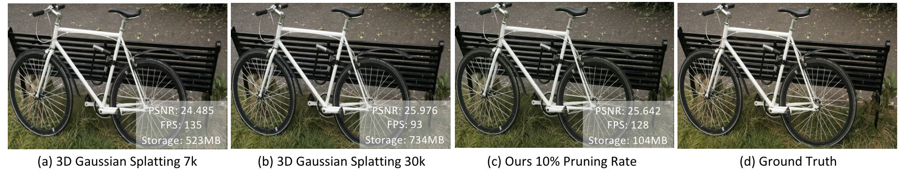
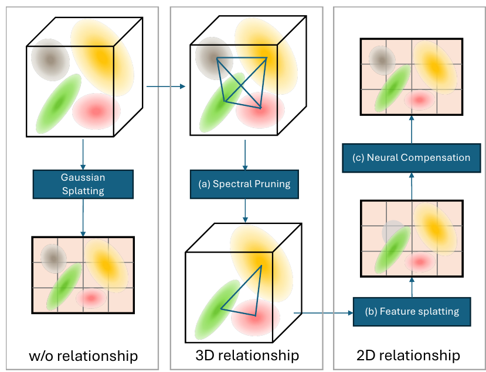
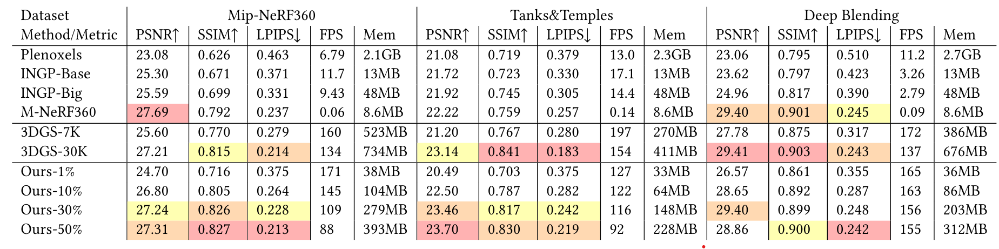
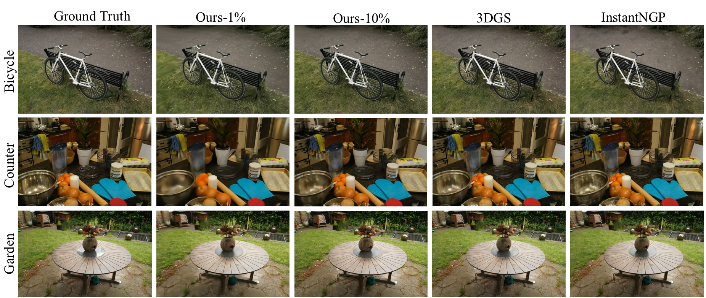

# Spectrally Pruned Gaussian Fields with Neural Compensation (SUNDAE)
*Authors: Yang, Runyi, et al

## Summary

    

    Fig1. Comparison of 3D gaussian splatting and proposed SUNDAE

Conventional 3D Gaussian Splatting (3DGS) 
- Pros: Superior rendering speed and quality  
- Cons: High memory consumption  
  
Proposed SUNDAE  
- It constructs a memory-efficient Gaussian field using spectral pruning and neural compensation.  
- It considers the relationship between primitives, reducing memory usage while maintaining rendering quality.  
- It significantly reduces memory consumption while preserving high rendering quality.  
- Code: https://runyiyang.github.io/projects/SUNDAE/.  

## Introduction

    

    Fig2. Conceptual illustration of vanilla 3DGS, SUNDAE spectral pruning technique, and neural compensation.

  

### 3DGS
Recently, 3DGS has been proposed as a novel 3D scene representation, utilizing a set of 3D positions, opacity, anisotropic covariance, and spherical harmonic (SH) coefficients to represent a 3D scene (left panel of Fig. 2).
3DGS demonstrates notable advantages in rendering speed, rendering quality, and training time. But it requires a large storage.

### Spectral graph pruning
Gaussian fields utilize a collection of Gaussian primitives as the representation of the scene. As these primitives are irregularly distributed in 3D space, we propose a graph-based data structure, rather than regular structures like grids, to capture the relationship between these primitives (middle panel of Fig. 2).

### Neural compensation
To address an inevitable decrease in rendering quality, they employ a neural compensation head to compensate for this quality loss (right panel of Fig. 2).

### Contributions
- A newly proposed primitive pruning framework for Gaussian fields based upon the spectrum of primitive graphs;
- A novel feature splatting and mixing module to compensate for the performance drop caused by the pruning;
- State-of-the-art results, in terms of both quality and speed, on various benchmarks with low memory footprint.

## Methods

## Results
### Quantitative Results

    

    Fig2. Quatitative evaluation of SUNDAE.

  

SUNDAE demonstrates strong performance across various metrics, including PSNR, SSIM, FPS, and memory usage. 
- Compared to existing methods on the MipNeRF360 dataset, SUNDAE achieves a balance between rendering quality and efficiency, maintaining high FPS rates while significantly reducing memory consumption.
- Even at low sampling rates, SUNDAE remains competitive with established approaches, showcasing the effectiveness of its spectral pruning and neural compensation techniques in managing Gaussian primitive relationships and retaining scene information.
- Overall, SUNDAE represents scenes more compactly while maintaining high quality rendering.

### Qualitative Results

    

    Fig2. Qualitative results of SUNDAE.

  

The qualitative results demonstrate that SUNDAE achieves comparable novel view synthesis quality with significantly lower memory consumption (1% or 10%).
- The graph effectively captures primitive relationships, while the neural compensation head preserves rendering quality.
- Spectral pruning notably removes outliers near the camera, enhancing scene coherence.
- 
### Ablation Study

### Efficiency Evaluation

## Conclusion
- They propose SUNDAE, a novel approach to spectrally prune Gaussian fields with neural compensation, efficiently capturing the relationship between Gaussian primitives using graph signal processing and blending information to offset pruning-induced information loss.
- By leveraging spatial information among Gaussian primitives to construct a graph and spectrally pruning less significant ones, they employ a lightweight neural network to compensate for quality degradation post-pruning.
- Experimental findings demonstrate SUNDAE's ability to maintain the efficiency of 3DGS while significantly reducing its size across various scenarios.
