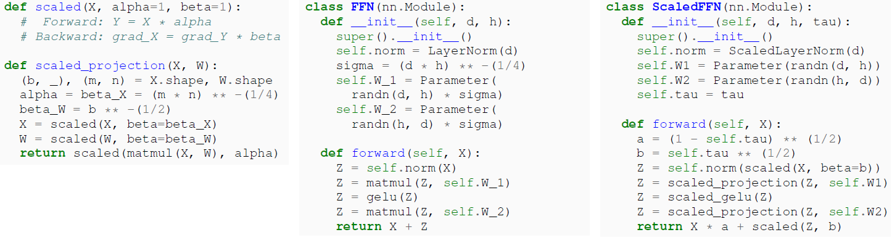
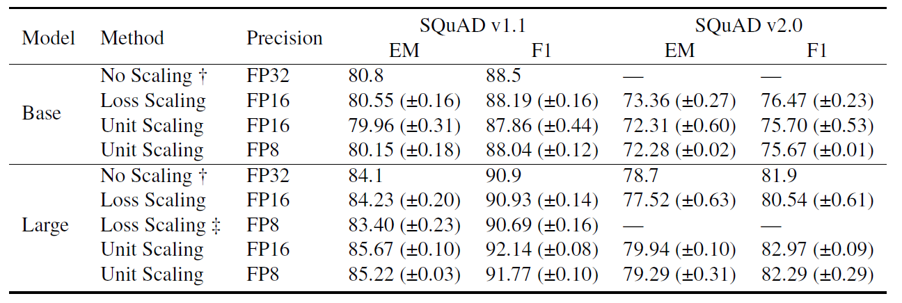

## Unit Scaling

Unit scaling is proposed to address the limitations of existing methods for managing scale in typical models. A model is considered unit-scaled if its activations, weights, and gradients have approximately unit variance at initialization. This is achieved by inserting scaling factors into the forward and backward passes. Unlike loss scaling, which requires an empirically determined hyperparameter or an adaptive algorithm, unit scaling determines these scales based on a set of rules for each operation, approximately preserving the variance of the inputs. This leads to global unit scaling throughout the model, ensuring tensor values are centered within the exponent range at initialization, providing headroom during training to avoid going out of range.

### A framework for scaling computational graphs

+ Computational Graphs
    + Represent model by the differentiable function f_{model}(x_1,...,x_m)
    + Describe the structure of such a model using a directed acyclic graph (DAG) denoted \mathcal{G} =(\mathcal{V}, \mathcal{E}) 
    + This kind of graph is commonly known as a *computational graph*, with vertices as *nodes* and their corresponding functions
as *ops*.
+ Forward and backward graphs
    + We refer to the computational graph corresponding to f_{model} as the **forward graph**
    + In deep learning we typically apply reverse-mode automatic differentiation to the forward graph to create a second computational graph whose output nodes represent the partial derivatives of the model with respect to its inputs:  \frac{\partial f_{model}}{\partial x_i}, \forall i \in[1 . . m] . We call this the *backward graph*

+ Scaled ops
    +  Given an op f\left(x_1, \ldots, x_k\right), we define the *scaled op*  f^*\left(x_1, \ldots, x_k, \alpha, \beta_1, \ldots, \beta_k\right)  with *scaling factors*  \alpha, \beta_1, \ldots, \beta_k \in \mathbb{R}^{+} , such that

f^* & \triangleq \alpha \cdot f\left(x_1, \ldots, x_k\right)

 f_{\text {grad }}^*\left(x_1, \ldots x_k, g\right)_i & \triangleq \beta_i \cdot f_{\text {grad }}\left(x_1, \ldots x_k, g\right)_i, \forall i \in[1 . . k] 

+ Scaled computational graph
    + A scaled computational graph is one where every op f in the forward graph is replaced by a scaled equivalent f^{*}, with the backward graph then generated to produce f^{*}_{grad} grad for each f_{grad}, using any choice of scaling factors.
      
+ Constraint-scaled computational graphs
    + A constraint-scaled computational graph is a scaled computational graph where we restrict the scaling factors of ops that consume non-cut-edge variables in the following way: for any edge e \notin \mathcal{C}, we require the op consuming the variable x_e to have scaling factors \alpha = \beta_e f. 

**Proposition 5.1**

*For any scaled op, there is an equivalent unscaled op with the same training dynamics under a firstorder optimiser.*

**Theorem 5.2**

*A constraint-scaled computational graph itself represents a scaled op.*

### A scaling strategy for unit variance

+ Unit scaled computational graphs
    + Initially set aside any scale constraints, and calculate the scaling factors that give each op expected unit variance outputs (this process is covered below).
    + Now resolve any scale constraints by taking each constrained group  {\alpha, \beta_1, \ldots, \beta_l }  and selecting the geometric mean  \left(\alpha, \beta_1, \ldots, \beta_l \right)^\frac{1}{l+1} 

+ Selecting scaling factors
    + Assuming unit-scaled inputs to  y = f(x_i,\ldots,x_k) , derive the output scale  \sigma_Y  and set the forward scaling factor  \alpha = 1/\sigma_Y  . Repeat this process for  x_i'=f_{grad}(\ldots)_i, \forall i \in[1 . . k] , to obtain the gradient scale  \sigma_{x_i'}  i and set the backward scaling factor  \beta_i = 1/\sigma_{x_i'}  . 

### Weighted addition

When tensors of different scales, such as those in residual layers, losses, and positional encodings, are added, simply adding them can adversely affect performance. To address this, we propose using weighted_add. In this approach, we can maintain unit scale while performing operations using a scaled identity function.

### Recipe
We now outline a high-level recipe for a unit-scaled model:
1. Initialise non-bias parameters with unit variance.
2. Calculate scaling factors for all scaled ops.
3. Identify non-cut-edges, and constrain the ops consumingthem to have  \alpha = \beta  by taking the geometric mean.
4. Replace adds with weighted adds.

### Example

Using the unit scaling recipe, we first build a scaled op, and then a full scaled layer. Consider a scaled projection op with learnable weights:

     \operatorname{matmul}^*(X,W) =\alpha \cdot X W  

     \operatorname{matmul}_{\text {grad }}^*(X, W, G)_1 = \beta_1 \cdot G W^{\top}    

   

     \operatorname{matmul}_{\text {grad }}^*(X, W, G)_2 = \beta_2 \cdot X^{\top} G 

  

for input  X \in \mathbb{R}^{b \times m}  , weight   W \in \mathbb{R}^{m \times n} , output  \mathbb{R}^{b \times n}  and incoming gradients  G \in \mathbb{R}^{b \times n} 

We show code for the above in Figure 3, which also gives a scaled layer for the Transformer FFN 

    

    

    Fig3. PyTorch examples

## Results

+ Character language modelling

    + Experimental Setup: Train causal language models on WikiText-103 raw character language modeling, using cross-entropy loss during training and evaluating on bits per character (BPC). Below the product of these settings, we compare the performance of regular (baseline) and unit scaling in both FP32 and FP16.
        + *Sequence layer type*: Attention, RNN and Convolution
        + *Norm placement*: PreNorm, PostNorm and NoNorm
        + *Residual scaling*: default, fixed and running-mean

    + Results
        + First, these demonstrate the need for scaling when using FP16. This is due to gradient underflow, since loss scaling with a factor of 2048 resolves the issue.
        + Second, they demonstrate that unit scaling, despite changing the training behaviour of the model beyond just numerics, matches or even slightly improves upon baseline performance in almost all cases.
        + Finally, they show that no tuning is necessary when switching unit scaling to FP16.
        + suggest that running-mean or fixed are reasonable choices when using unit scaling
 

    

    Fig4. Character language modelling, showing validation bits per character over a wide range of models

+ Masked language modelling

    + Experimental Setup
        + To evaluate the advantages of unit scaling, we assess BERTBASE and BERTLARGE models, which typically struggle with loss scaling. 

    + Results

    

    Table2. Downstream performance of regular and unit-scaled BERT models

## Related Work

**Variance scaling analysis**
+ Variance scaling and residual networks, along with normalization variants, complement unit scaling, which considers both activation and gradient norms. The reparameterization implied by unit scaling, utilized in analyzing deep network training dynamics, applies scaling factors locally throughout the compute graph, akin to training hyperparameter scaling.

**FP8 inference**
+ FP8 training lacks hardware support, yet accelerated 8-bit inference is becoming more prevalent through integer quantization to INT8. While this process often leads to reduced accuracy, recent efforts aim to enhance efficient INT8 quantization. FP8 adoption allows accelerated inference in the same format as training, promising significant improvements in the simplicity and accuracy of 8-bit inference.
  
## Discussion

**Compute overhead**
+ Unit scaling introduces minimal compute overhead by adding scaling operations that can be fused into preceding operations, resulting in negligible memory-access cost. While basic loss scaling operates similarly, automatic loss scaling may incur additional overhead due to occasional batch discards, particularly noticeable in FP8. Proposed automatic per-tensor scaling schemes may introduce overhead, depending on software and hardware characteristics, as they trade off accuracy for complexity. In contrast, unit scaling with fixed precomputed scaling factors offers a simpler alternative without such complexities.
  
**Broader impact**
+ With the potential for unit scaling to effectively train larger models, concerns arise about issues such as toxicity, misinformation, privacy concerns, and environmental damage. To address these challenges, various methods have been proposed, including AI feedback, anti-experts, and baked-in safety models.
  
**Conclusion**
Unit scaling has demonstrated to address the complexities of low-precision training, providing a simpler and more granular solution, even enabling the training of BERTLARGE without loss scaling for the first time, even in FP8.
