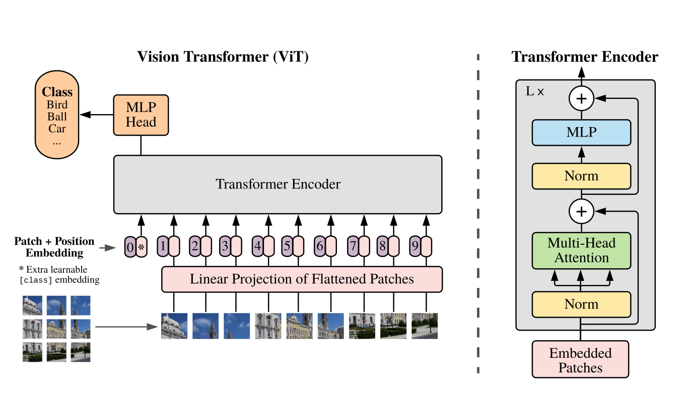
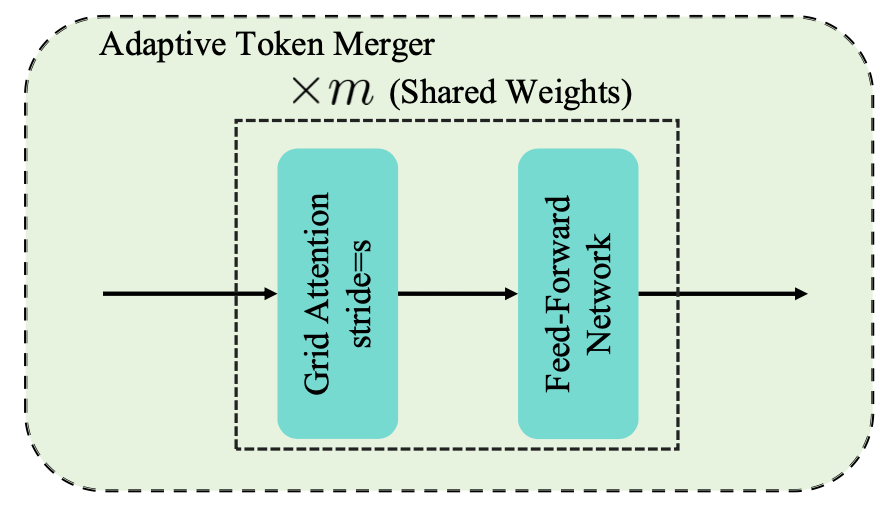
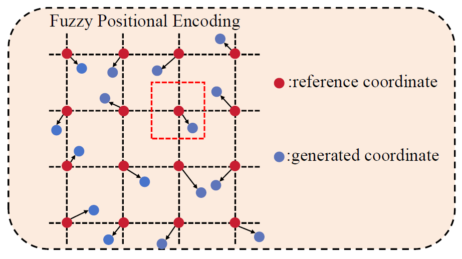
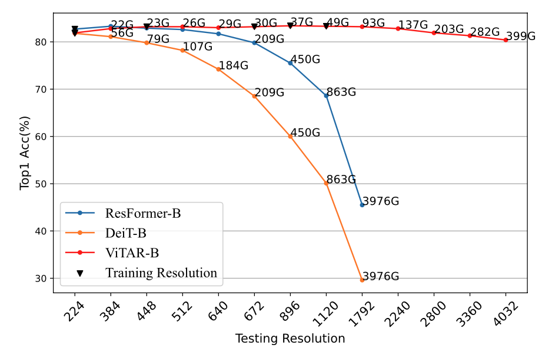

# **ViTAR: Vision Transformer with Any Resolution**
*Authors: Qihang Fan, Quanzeng You, Xiaotian Han, Yongfei Liu, Yunzhe Tao, Huaibo Huang, Ran He, Hongxia Yang*

## Vision Transformers (ViTs)

   

## Challenge: Multi-Resolution ViT Modeling

## Method: ViTAR

### 1. Adaptive Token Merger (ATM Module)

   

### 2. Fuzzy Positional Encoding (FPE)

   

## Experiments

   

