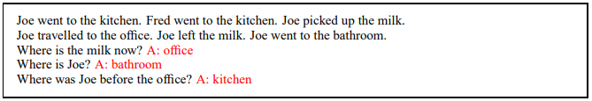
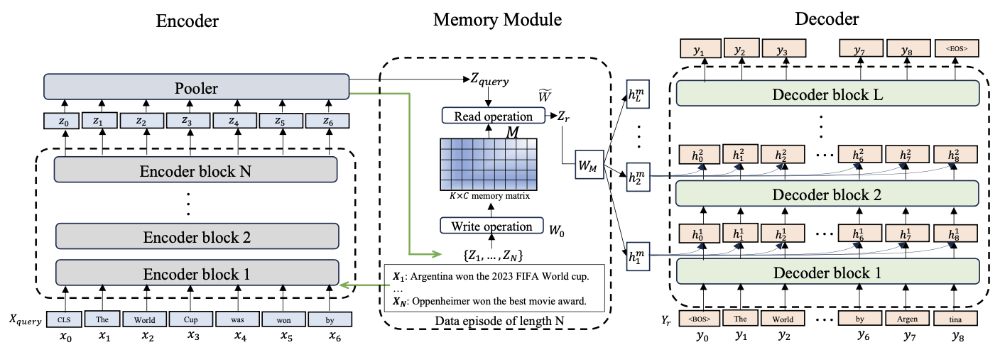
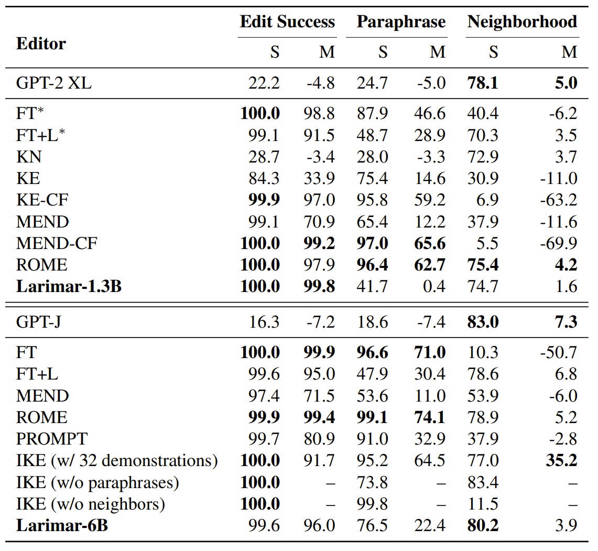
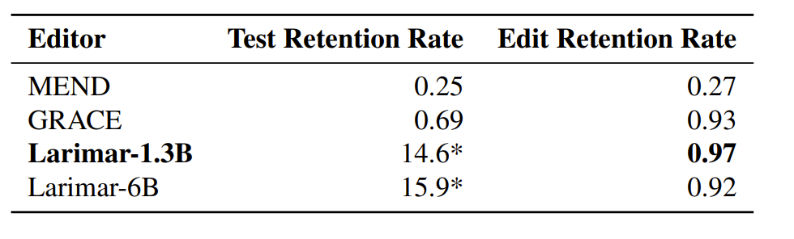
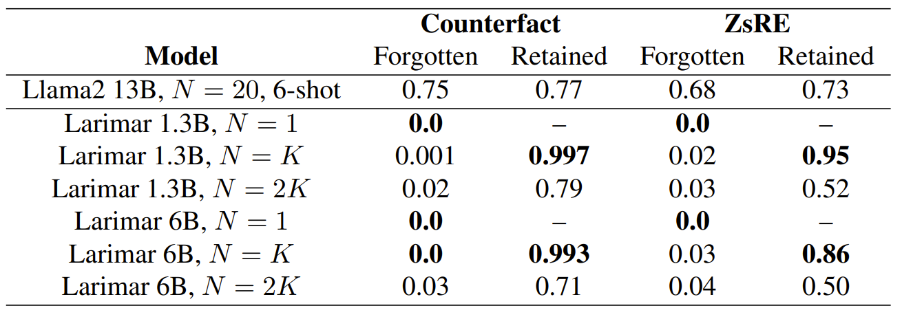
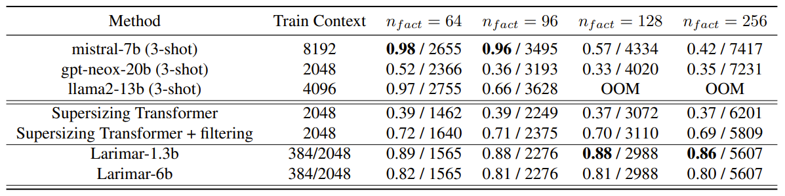

# Larimar: Large Language Models with Episodic Memory Control
*Posted by: Sunggyu Jang, Hyeonwoo Park*

*Authors: Payel Das (IBM AI Research), Subhajit Chaudhury (IBM AI Research) et.al*

## 1. Background
Large Language Model (LLM) is one of the most popular topics in these days, due to their outstanding performance on various Natural Language Processing (NLP) tasks. However, LLM has faced a lot of challenges at the same time. In this report, we especially focus on the "knowledge edit" problem.

### Knowledge edit in LLM research
Knowledge edit problem can be summarized as "constantly updating the knowledge of pre-trained LLMs to keep models fact-relevant, safe, and ethical after deployment." [1] The point is that, we have to update the knowledge on the pre-trained model accurately and quickly. Figures below illustrate why do we need knowledge update.
 1) To update new knowledge
 2) To mitigate context length generalization problem
 3) To erase sensitive data

    

    (Fig1. Knowledge update: New knowledge should be injected constantly [2])

    

    (Fig2. Context length generalization: The ability to quickly update the LLM can help with "input context length generalization problem" [3])

    

    (Fig3. Selective fact forgetting: LLMs should forget personal & sensitive data [4])

### Memory network
However, knowledge edit is not so simple as it sounds. Pre-training LLMs requires substantial computational cost due to thier unprecedented amounts of parameters. Considering the fact that we have to introduce new knowledge into the pre-trained model frequently, re-training the whole model is not a feasible solution [2]. 

To tackle the problem, "memory network" was proposed. The main point of memory network is "to combine the successful learning strategies developed in the machine learning literature for inference with a memory component that can be read and written to." [5]

For example, let's assume that you're providing new information to a pre-trained LLM. What you expect to the model is to answer the following questions based on the facts you mentioned. In this case, the model can do the job by writing the knowledge from you into a memory and reading the relevant one from the memory to answer the question. This problem is called as "Question Answering (QA)."

In this paper, authors followed the method from [6]. For more details, please refer to '3. Model architecture' and '4. Memory Operations.'

    

    (Fig4. Example of QA [5])

### Autoencoder

TODO : This content can be erased

    

    (Fig5. Autoencoder)

### Neocortex-Hippocampus interactions
This paper imitates the role of brain. Humans can rapidly update their knowledge after encountering the first relevant instance. In the brain, this process is facilitated through interactions between the neocortex and the hippocampus. The hippocampus is the site for storing long-term memories, while the neocortex integrates long-term and short-term memories to relay the results to the body. 

     

    (Fig6. Neocortex and the Hippocampus)

The Complementary Learning Systems (CLS) theory proposes a model that combines these complementary learning systems of the hippocampus and neocortex. The interaction between the neocortex and hippocampus in the brain is known to promote adaptive behavior through memorization and generalization. Furthermore, it is suggested that memory consolidation from the hippocampus to the neocortex is facilitated by the activation synchronized with multiple exact or false replays of the encoded experience in the hippocampus. This implies that the hippocampus functions as a generative associative network.

## 2. Contributions
1. Larimar introduces a class of memory-conditioned language models inspired by complementary learning mechanisms in the brain. This architecture facilitates real-time test-time adaptation without requiring time-intensive gradient-based learning or internal fact tracing, offering a faster method for updating LLMs.
Utility Demonstration in Knowledge Editing and Context Generalization:

2. The proposed method is demonstrated on two significant and challenging use cases: knowledge editing and generalizing to longer input contexts. Larimar exhibits fast and accurate training-free adaptation to new inputs in both scenarios, outperforming baseline editing methods and existing language models.
Selective Fact Forgetting and Information Leakage Prevention:

3. Larimar effectively supports selective fact forgetting and prevents information leakage using its one-shot memory updating mechanism.
Recursive Search-Based Solution for Long Context Generalization: A simple recursive search-based approach is provided to enable Larimar's memory to generalize to longer input contexts.

## 3. Model architecture
Larimar consists of three main components: encoder, decoder, and adaptive memory.
1) Encoder: Transforms the input into a latent vector
2) Decoder: Generates an answer to the question conditioned on the memory
3) Memory: Stores episodes in encoded form

    

    (Fig7. Larimar architecture)

## 4. Memory Operations

## 5. Results
### Wall Clock time

    

    (Fig8. Comparison between different editing methods and the wall clock time for a single edit)

The experiment was conducted on a single A100 GPU. Comparing the wall clock time for each editing method across 10 single edits, as shown in Fig8, Larimar was found to be approximately 4-10 times faster than the existing ROME and GRACE methods. Additionally, Larimar demonstrates the ability to address sequential edits, batch edits, and forgetting/deletion, which were not previously addressed in existing work.

### Single Fact Editing
This paper utilizes the CounterFact dataset for comparing Single Fact editing. The CounterFact dataset is designed to test the language model's ability to handle counterfactual edits. It evaluates whether the model accurately learns new facts. It contains a total of 21,919 data points, and the evaluation is conducted using the first 2000 samples. In contrast to training the LLM on edits or causally tracing the original fact within the LLM and updating the relevant parameters, Larimar leverages one-shot memory update for editing. In this approach, the memory posterior is updated as the edit(s) of interest is written, and then the updated memory is queried. The read-out from the memory conditions the decoder to output the edit.

    

    (Fig9.Single fact edit performanceon CounterFact dataset comparing with baseline. Top two best systems are highlighted.)

The results are shown in Fig 9. Edit Success measures the percentage of cases where the edited result has a higher probability than the original result, while Paraphrase evaluates whether the model achieves the same performance using paraphrase prompts. Neighborhood assesses the model's ability to retain knowledge about the original object. Larimar demonstrates comparable performance in editing new facts and handling prompts.

### Sequential Fact Editing

    

    (Fig10. Selective fact forgetting: LLMs should forget personal & sensitive data)

### Selective Forgetting

    

    (Fig11. Selective fact forgetting: LLMs should forget personal & sensitive data)

### Recall Performance

    

    (Fig12. Selective fact forgetting: LLMs should forget personal & sensitive data)

## 6. Conclusion

## 7. References

[1] https://arxiv.org/abs/2403.11901
 -> Larimar: Large Language Models with Episodic Memory Control

[2] https://arxiv.org/abs/2310.16218
 -> Knowledge Editing for Large Language Models: A Survey

[3] https://arxiv.org/abs/2207.04901
 -> Exploring Length Generalization in Large Language Models

[4] https://arxiv.org/abs/2402.05813
 -> Selective Forgetting: Advancing Machine Unlearning Techniques and Evaluation in Language Models

[5] https://arxiv.org/abs/1410.3916
 -> Memory Networks
 
[6] https://openreview.net/forum?id=Harn4_EZBw
 -> Generative Pseudo-Inverse Memory

https://arxiv.org/abs/2403.11901

[brain figure](https://www.rallyware.com/blog/the_neuroscience_behind_successful_talent_development)

