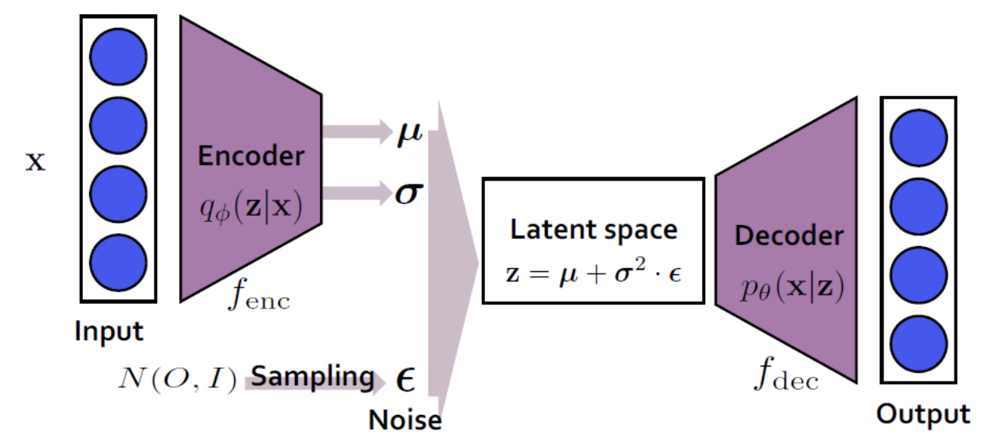
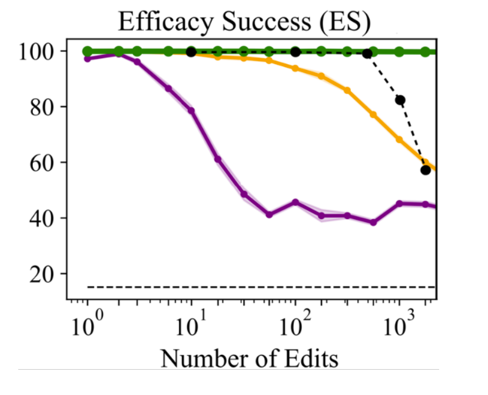

# Larimar: Large Language Models with Episodic Memory Control
*Posted by: Sunggyu Jang, Hyeonwoo Park*

*Authors: Payel Das (IBM AI Research), Subhajit Chaudhury (IBM AI Research) et.al*

## 1. Background
Large Language Model (LLM) is one of the most popular topics in these days, due to their outstanding performance on various Natural Language Processing (NLP) tasks. However, LLM has faced a lot of challenges at the same time. In this report, we especially focus on the "knowledge edit" problem.

### Knowledge edit in LLM research
Knowledge edit problem can be summarized as "constantly updating the knowledge of pre-trained LLMs to keep models fact-relevant, safe, and ethical after deployment." [1] The point is that, we have to update the knowledge on the pre-trained model accurately and quickly. Figures below illustrate why do we need knowledge update.
 1) To update new knowledge
 2) To mitigate context length generalization problem
 3) To erase sensitive data

    

    Fig1. Knowledge update: New knowledge should be injected constantly [2]

    

    Fig2. Context length generalization: The ability to quickly update the LLM can help with "input context length generalization problem" [3]

    

    Fig3. Selective fact forgetting: LLMs should forget personal & sensitive data [4]

### Memory network
However, knowledge edit is not so simple as it sounds. Pre-training LLMs requires substantial computational cost due to thier unprecedented amounts of parameters. Considering the fact that we have to introduce new knowledge into the pre-trained model frequently, re-training the whole model is not a feasible solution [2]. 

To tackle the problem, "memory network" was proposed. The main point of memory network is "to combine the successful learning strategies developed in the machine learning literature for inference with a memory component that can be read and written to." [5]

For example, let's assume that you're providing new information to a pre-trained LLM. What you expect to the model is to answer the following questions based on the facts you mentioned. In this case, the model can do the job by writing the knowledge from you into a memory and reading the relevant one from the memory to answer the question. This problem is called as "Question Answering (QA)."

    

    Fig4. Example of QA [5]

### Variational auto encoder (VAE)
To implement the idea of memory network, concepts from variational auto encoder are usually used. VAE is a kind of generative model to generate an output similar to real data. To be specific, it aims to approximate the true distribution of input data with three components - encoder, decoder, and latent space.

In this post, we assume that readers have knowledge about VAE. For details, please refer to [6] and [7].

    

    Fig5. VAE Structure [7]

### Neocortex-Hippocampus interactions
This paper imitates the role of brain. Humans can rapidly update their knowledge after encountering the first relevant instance. In the brain, this process is facilitated through interactions between the neocortex and the hippocampus. The hippocampus is the site for storing long-term memories, while the neocortex integrates long-term and short-term memories to relay the results to the body. 

     

    Fig6. Neocortex and the Hippocampus

The Complementary Learning Systems (CLS) theory proposes a model that combines these complementary learning systems of the hippocampus and neocortex. The interaction between the neocortex and hippocampus in the brain is known to promote adaptive behavior through memorization and generalization. Furthermore, it is suggested that memory consolidation from the hippocampus to the neocortex is facilitated by the activation synchronized with multiple exact or false replays of the encoded experience in the hippocampus. This implies that the hippocampus functions as a generative associative network.

## 2. Contributions
1. Larimar introduces a class of memory-conditioned language models inspired by complementary learning mechanisms in the brain. This architecture facilitates real-time test-time adaptation without requiring time-intensive gradient-based learning or internal fact tracing, offering a faster method for updating LLMs.
Utility Demonstration in Knowledge Editing and Context Generalization:

2. The proposed method is demonstrated on two significant and challenging use cases: knowledge editing and generalizing to longer input contexts. Larimar exhibits fast and accurate training-free adaptation to new inputs in both scenarios, outperforming baseline editing methods and existing language models.
Selective Fact Forgetting and Information Leakage Prevention:

3. Larimar effectively supports selective fact forgetting and prevents information leakage using its one-shot memory updating mechanism.
Recursive Search-Based Solution for Long Context Generalization: A simple recursive search-based approach is provided to enable Larimar's memory to generalize to longer input contexts.

## 3. Model architecture & Memory operations
Inspired by human brain (neocortex-hippocampus interactions), authors suggest "a class of LLMs augmented with an external episodic memory controller." They utilize an episodic memory to mimic hippocampal fast-learning system, and use LLM as a neocortical slow learning system.

Fig7 below shows the overall architecture of Larimar. Basic idea is to implement VAE with external memory. It consists of three main components: encoder, decoder, and adaptive memory. 

1) Encoder: Transforms the input into a latent vector
2) Decoder: Generates an answer to the question conditioned on the memory
3) Memory: Stores episodes in encoded form

    

    Fig7. Larimar architecture

Our goal is to understand how to determine the writing weight and reading weight.

First of all, let's consider the write operation (green arrows in Fig7). Data episode of length N is transformed into a latent vector through an encoder. Then, the posterior memory M given the data Z and the writing weight W0 is calculated [8]. 

First, overall flow shows that model architecture is based on that of VAE. 

sparse distributed memory is used for stroing and retrieving large amounts of information without focusing on the accuracy but on similarity of information. - wiki

$$A_{11} \equiv B(modC)$$

## 4. Memory Operations

In this paper, authors followed the basic structures from [8] to combine pre-trained LLMs and memory component for knowledge edit. On top of that, they suggest "a class of episodic and adaptable memory-conditioned LLM architecture." 

    

    Fig8. Basic memory operations [8]

## 5. Results
### Wall Clock time

    

    Fig9. Comparison between different editing methods and the wall clock time for a single edit

The experiment was conducted on a single A100 GPU. Comparing the wall clock time for each editing method across 10 single edits, as shown in Fig8, Larimar was found to be approximately 4-10 times faster than the existing ROME and GRACE methods. Additionally, Larimar demonstrates the ability to address sequential edits, batch edits, and forgetting/deletion, which were not previously addressed in existing work.

### Single Fact Editing
This paper utilizes the CounterFact dataset for comparing Single Fact editing. The CounterFact dataset is designed to test the language model's ability to handle counterfactual edits. It evaluates whether the model accurately learns new facts. It contains a total of 21,919 data points, and the evaluation is conducted using the first 2000 samples. In contrast to training the LLM on edits or causally tracing the original fact within the LLM and updating the relevant parameters, Larimar leverages one-shot memory update for editing. In this approach, the memory posterior is updated as the edit(s) of interest is written, and then the updated memory is queried. The read-out from the memory conditions the decoder to output the edit.

    

    Fig10.Single fact edit performanceon CounterFact dataset comparing with baseline. Top two best systems are highlighted.

The results are shown in Fig 9. Edit Success measures the percentage of cases where the edited result has a higher probability than the original result, while Paraphrase evaluates whether the model achieves the same performance using paraphrase prompts. Neighborhood assesses the model's ability to retain knowledge about the original object. Larimar demonstrates comparable performance in editing new facts and handling prompts.

### Sequential Fact Editing
To check sequential fact editing, Test retention rate(TRR) and edit retention rate(ERR) are used. TRR check how well an edited model retains its performence on tis original testing data. Larminar decoder's perplexity was tested on 1000 random test samples from wikitext using a separate language model.  In comparison, baseline models compute TRR from mean F1 scores from 1000 random samples of NQ data. ERR check how well an edited model retains previous edits. This paper, ERR was evaluated by F1 score after 1000 sequential edits when querying the memory with the encoded query Zquery for each written fact. 

    

    Fig11. Sequential editing on ZsRE dataset

According to the figure 9, Larimar’s comparable ERR performance to GRACE, while preserving its original test set performance.Larimar-1.3B achieves editing speeds approximately 10 or more times faster than GRACE on GPT-2 XL.

### Selective Forgetting
This results shows that specific fact can be selectively erased from N facts that are have been written in Larimar's memory. 

    

    Fig12. Batch editing accuracy on counterfact dataset. Green: MEMIT, Orange: ROME, Magenta: MEND, Black: Larimar.

Fig 10 shows many edits can be written at once to memory and accurately retrieve from it. Rewrite accuracy is near 100% for up to 512 edits (the memory size K) and then drops to 82% for 1024 edits. This result shows Larimar's ability to compress more than K facts into its size-K memory. This performance level is higher when compared to baselines like MEND and ROME, but subpar compared to MEMIT, which can accurately handle a very large batch of edits at a cost of reduced editing speed and is also not meant to handle sequential editing.

To test the ability of Larimar for selectively forgetting specified facts during inference, write N facts to memory and then forget one fact, and also write to memoty in its place the same fact with the answer replaced with the string "unknown." Then, compare recall for the forgotten fact before and after the forgetting operation.  Paper also report the recall on the remaining N −1 facts in memory to demonstrate that forgetting does not compromise other memories. The samples used are from the ZsRE validation set and from the Counterfact test set.

    

    Fig13. Fraction of facts with accurate recall, for the Counterfact and ZsRE datasets, after writing N factrs to memory and removing one.

As a result, Larimar achived higher performance in forgotten and retained information is all testbench than Basemodel. This shows that Larimar works better on selective forgetting.

### Recall Performance
Larimar performs fact recall with long context using data that is not present in the base decoders pretraining corpus. Facts are curated from CNN Fast Facts. Recursive search in the latent memory space and using readouts to construct new higher-level memory is performed to process the long context with Larimar’s memory trained on a relative small episode length. It should be noted that memory hierarchy is also found in hippocampus and thought to be implicated in learning.

The recall rate, in the context of information retrieval, is a measure of how well a system retrieves all relevant items of a specific class. It represents the proportion of relevant items that the system correctly identifies out of all the relevant items available.
For example, in a search engine scenario, the recall rate indicates how many of the relevant documents related to a user's query are successfully retrieved by the system. A high recall rate implies that the system effectively captures most, if not all, of the relevant information.

    

    Fig14. Novel fact addition recall rate on FastFacts.

Fig 12 shows Larimar’s recall performance does not degrade much with increasing input context length, even
compared to some of most competitive baseline LLMs trained with longer training context. We also compare with Supersizing Transformer, which is a memory-augmented model, however it did not show competitive recall performance because it was not trained to perform memory-conditioned generation. Due to memory
processing in the latent space, Larimar is also efficient is terms of number of KV cache token computation compared to baseline methods. 

## 6. Conclusion

## 7. References

[1] https://arxiv.org/abs/2403.11901
 -> Larimar: Large Language Models with Episodic Memory Control

[2] https://arxiv.org/abs/2310.16218
 -> Knowledge Editing for Large Language Models: A Survey

[3] https://arxiv.org/abs/2207.04901
 -> Exploring Length Generalization in Large Language Models

[4] https://arxiv.org/abs/2402.05813
 -> Selective Forgetting: Advancing Machine Unlearning Techniques and Evaluation in Language Models

[5] https://arxiv.org/abs/1410.3916
 -> Memory Networks

[6] https://arxiv.org/abs/1312.6114
 -> Auto-Encoding Variational Bayes

[7] https://process-mining.tistory.com/161
 -> VAE, blog post

[8] https://openreview.net/forum?id=Harn4_EZBw
 -> Generative Pseudo-Inverse Memory

 

[brain figure](https://www.rallyware.com/blog/the_neuroscience_behind_successful_talent_development)

