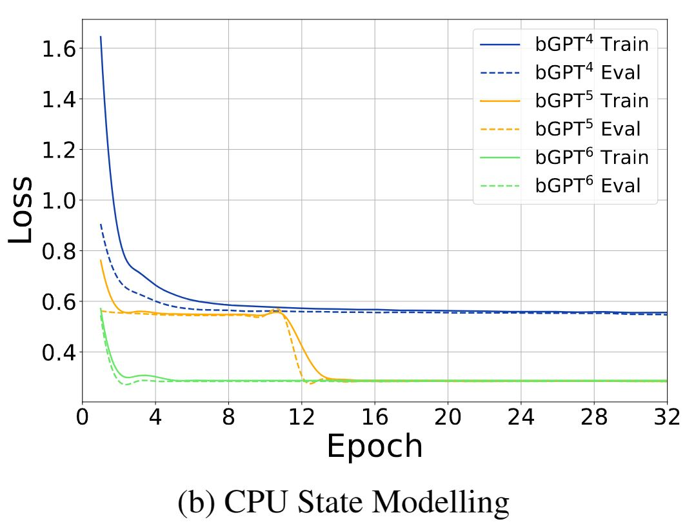

# **Beyond Language Models: Byte Models are Digital World Simulators**
*Authors: Shangda Wu, Xu Tan, Zili Wang, Rui Wang, Xiaobing Li, Maosong Sun*

Byte models expand traditional language models to the byte level, starting from the premise that all digital data and operations are fundamentally byte-based. These models process data from various modalities such as text, audio, and images uniformly as bytes, increasing their applicability in a wide digital environment.

In this paper, bGPT is introduced. bGPT is designed to model digital data at the byte level and is optimized to effectively process byte sequences. It has demonstrated performance comparable to specialized models across various modalities, including text, audio, and images, and offers new possibilities for predicting, simulating, and diagnosing hardware operations. Designed to predict and understand bytes, bGPT provides a deeper understanding of and interaction with digital systems.

     

The bGPT framework simulates digital systems using native binary data. It integrates diverse data types into a single model by treating everything as a byte sequence.

***

### **Exploring bGPT**

***Architecture*** 

Learning patterns in digital systems at the byte level provides a unified approach to integrating various data types, but the high resolution of bytes results in long sequences that significantly increase computational costs. This issue is especially pronounced in transformer-based models, limiting the efficiency and scalability of processing binary data.
bGPT is equipped with a hierarchical structure designed to efficiently handle entire byte sequences. This structure segments a sequence of byte 
B = \{b_1, b_2, \ldots, b_T\} of length T into a sequence of patches \mathcal{P}, where each patch contains exactly S bytes:
\mathcal{P} = [P_1, P_2, \ldots, P_N] where N = \left\lceil \frac{T}{S} \right\rceil is the number of patches,

P_i = [b_{(i-1)S+1}, \ldots, b_{(i)S}] for ( 1 \leq i \leq N), if T \mod S \neq 0, the last patch defined as P_N = [b_{(N-1)S+1}, \ldots, b_T, \underbrace{e, \ldots, e}_{S - (T \mod S)}] where e represents the `<eop>` (end-of-patch).

***Components***

     

- **Linear Projection Layer**: Each byte patch is mapped to a high-dimensional feature space through a linear projection layer. During this process, each byte is encoded into a 257-dimensional vector, which includes the 256 possible byte values and a special `<eop>` (end-of-patch) token.
- **Patch-Level Decoder**: The embedded patches are processed by a patch-level decoder. This decoder plays a role in predicting the features of the next patch from the embedding of each patch, thereby learning the structural patterns of the entire dataset.
- **Byte-Level Decoder**: Based on the predicted patch features, the byte sequence within each patch is reconstructed. The byte-level decoder uses the features of each patch to predict the next byte within that patch, processing the detailed information of the entire byte sequence.

***Model Training***

**1. Generative Modeling**

This approach requires the model to predict the next byte in a given byte sequence. The model takes the byte sequence B = \{b_1, b_2, \ldots, b_T\} as input and utilizes all previous byte information to predict the next byte b_{i+1} at each position.

As a loss function, the negative log likelihood of the next byte at each step is minimized. This encourages the model to maximize the likelihood of the actual occurrence of the next byte.
\mathcal{L}_{\text{GEN}}(\theta) = - \sum_{i=1}^{T-1} \log p(b_{i+1} \mid b_1, b_2, \ldots, b_i; \theta)

**2. Classification**

Based on the knowledge acquired through generative modeling, bGPT can also be applied to classification tasks for labeled datasets. In this process, the model takes a byte sequence as input and predicts the category to which that sequence belongs.
For classification tasks, the loss function used is the cross-entropy loss, which ensures that the model accurately outputs the prediction probabilities for each category.

\mathcal{L}_{\text{CLF}}(\theta) = - \sum_{k=1}^{K} y_k \log p(y_k \mid B; \theta)

These training objectives enable bGPT to understand various byte-based data and accurately mimic digital patterns of the real world. The combination of generative approaches and classification capabilities grants the model the flexibility to tackle a diverse range of problems. Through this, the model can go beyond simple pattern recognition to play a crucial role in predicting and analyzing the operations of complex digital systems.

***

### Applications

***1. Digital Media Processing***

bGPT is used for processing various types of digital media data such as text, audio, and images. This model performs learning targeted at media files through generative modeling, transforming the data into features and subsequently performing classification tasks based on these features.

For example, audio files are converted to and processed in WAV format, while images are processed at a low resolution in BMP format. By utilizing these standardized datasets, bGPT can develop a generalized understanding of various media types.

***2. Algorithm and Hardware Simulation***

bGPT is particularly useful for tasks such as data conversion and CPU state modeling. This means bGPT can learn the digital conversion process and simulate the operation of CPUs to predict the state of the CPU after various commands are executed.

For example, in the task of converting the music data format from ABC notation to MIDI format, bGPT learns to transform text-based music scores in ABC notation into binary performance signals in MIDI. Additionally, this model is also capable of performing the reverse conversion from MIDI back to ABC notation.

***

### Experiment

***1. Processing Various Digital Media***

**Experiment Overview**
To assess the flexibility and versatility of the bGPT model, experiments with various types of digital media data were conducted. This involved handling a wide range of file types including text, audio, and image data, with the aim to measure the model's ability to process these types and to see how well bGPT generalizes compared to specialized models. The experiment included both generative modeling and classification tasks.

**Experimental Data**
The datasets used in the experiment included:

- **Text**: Wikipedia data and AG news dataset.
- **Audio**: LibriSpeech and Speech Commands v2 dataset.
- **Images**: ImageNet and CIFAR-10 dataset.

These datasets are ideal resources for evaluating the diverse media processing capabilities of bGPT.

**Experimental Setup** 
The bGPT model was trained under various settings:

- **bGPTimage**: Trained exclusively with image data (ImageNet).
- **bGPTlibri**: Trained exclusively with text data (Wikipedia).
- **bGPTmix**: Trained with a mix of all the above datasets.

Each model was fine-tuned for specific types of classification and generative tasks post-pretraining, providing a direct comparison of each model's performance.

**Result and Analysis**

- **Text Processing**: bGPTwiki showed high classification accuracy on the AG News dataset, indicating bGPT's strong performance in text-based tasks.
- **Audio Processing**: bGPTlibri demonstrated excellent performance on the Speech Commands v2 dataset, showcasing its high potential in audio processing.
- **Image Processing**: bGPTimage recorded high accuracy on the CIFAR-10 dataset but showed somewhat lower performance on ImageNet. This suggests that while bGPT works well with relatively simple images, it may have limitations with more complex images.
  
  | Model           | \| AG News (4 classes) \| |           | CIFAR-10 (10 classes) \| |           | Speech Commands v2 (36 classes) \| |
|-----------------|----------------------------|-----------|----------------------------|-----------|------------------------------------|
|                 | BPB     | Acc (%)           | BPB       | Acc (%)                    | BPB       | Acc (%)                            |
|-----------------|---------|-------------------|-----------|----------------------------|-----------|------------------------------------|
| bGPT_random     | 1.3496  | 84.74             | 3.4928    | 76.73                      | 1.5414    | 92.43                              |
| bGPT_wiki       | **1.0639**  | **92.49**             | 3.6663    | 77.02                      | 1.5719    | 93.56                              |
| bGPT_image      | 1.4179  | 83.16             | **3.1234**    | **88.69**                      | 1.5326    | 93.91                              |
| bGPT_libri      | 1.3993  | 83.59             | 3.3345    | 83.51                      | **1.4818**    | **96.03**                              |
| bGPT_signal     | 1.4058  | 83.80             | 3.1554    | 87.65                      | 1.4898    | 95.66                              |
| bGPT_mix        | 1.0935  | 91.75             | 3.2279    | 84.32                      | 1.5086    | 95.09                              |
| Baselines       | 0.9237  | 94.50             | —         | **98.13**                      | —         | **98.11**                              |

***2.  Algorithm and Hardware Simulation***  

**Experiment Overview** 
One of the unique capabilities of the bGPT model is its ability to simulate the operations of algorithms and hardware. This experimental section assesses how bGPT handles complex data conversion processes and CPU state modeling tasks. These capabilities are particularly significant in the fields of cybersecurity, system diagnostics, and hardware optimization.

**Experiment Methods** 
bGPT's performance was evaluated in the following two key areas:

- **Data Conversion**: This experiment evaluates whether bGPT can learn the process of converting ABC music notation into MIDI format. The task tests how bGPT models complex algorithms and their ability to convert actual music files.
- **CPU State Modeling**: CPU state modeling assesses how bGPT predicts and updates the state of a CPU based on a given set of machine instructions. This is particularly useful for understanding and predicting hardware operations.

**Results and Analysis** 

# Two Images Side by Side

  
   

- **Data Conversion Performance**: bGPT performed the conversion between MIDI and ABC notation with high accuracy. Notably, it also showed high accuracy in converting MIDI back to ABC notation, indicating that bGPT successfully learned the inherent structures and patterns of the data.
- **CPU State Modeling Performance**: bGPT accurately predicted the resulting state of CPUs from an initial state across a variety of CPU instructions. It achieved over 99% accuracy even with complex instruction sequences, demonstrating bGPT's detailed understanding of the internal workings of hardware.

***

### **Conclusion and Future Work**

bGPT has proven to be a powerful model capable of effectively processing various types of digital media data. Particularly, this model can be flexibly applied to different types of data and has demonstrated performance that can compete with models pretrained on specific datasets. These results show that bGPT can be extremely useful in solving a wide range of real-world problems.

Moreover, bGPT has proven its ability to go beyond simply processing data, successfully modeling and simulating the operations of complex algorithms and hardware. This capability will be particularly valuable in fields related to technical problem solving and new hardware design.

bGPT extends deep learning to binary data processing through byte prediction. Experiments have demonstrated bGPT's strong scalability in native binary data modeling.

Future research directions for byte models include:

- Reducing training costs to make byte model training more feasible.
- Expanding the model and dataset sizes to accommodate a wider range of native binary data and handle larger digital media files such as high-resolution images and videos.
- Improving performance in underexplored tasks involving native binary data across various application domains.

