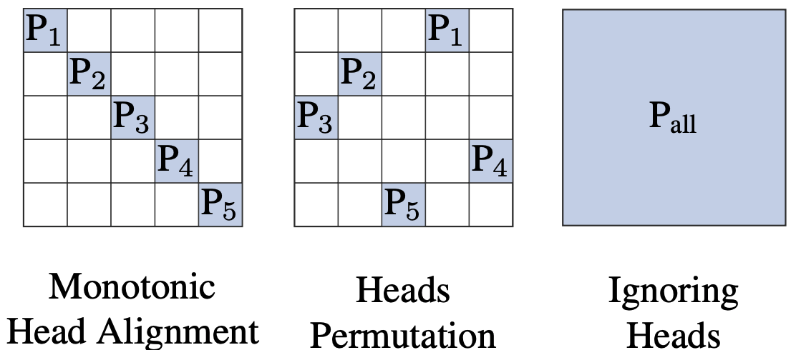
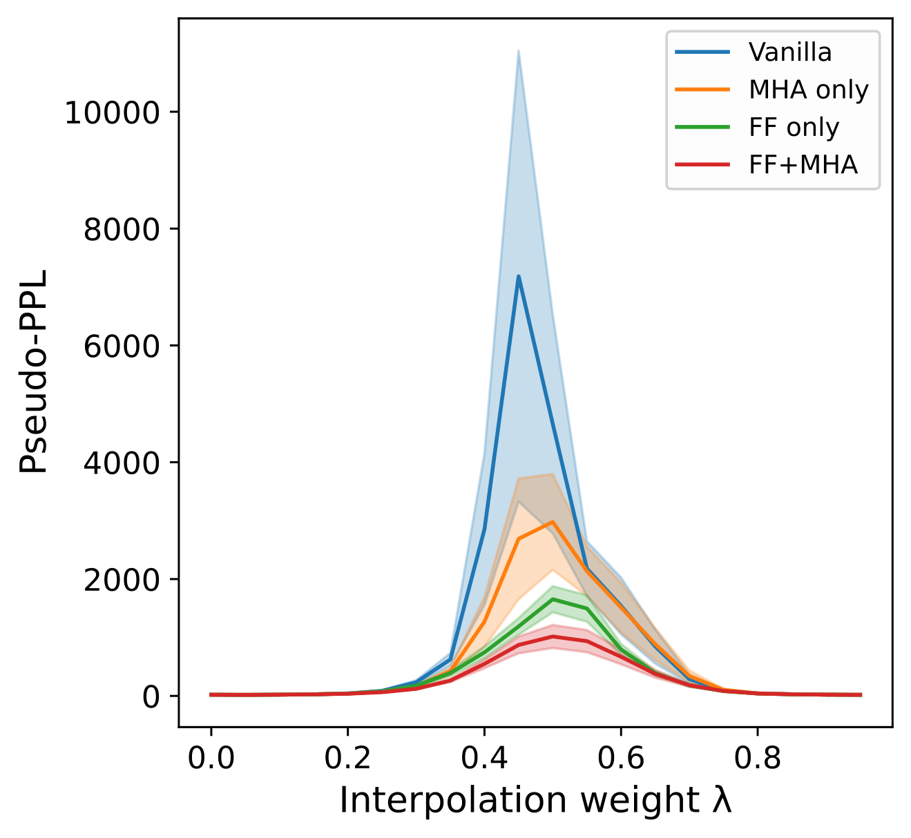
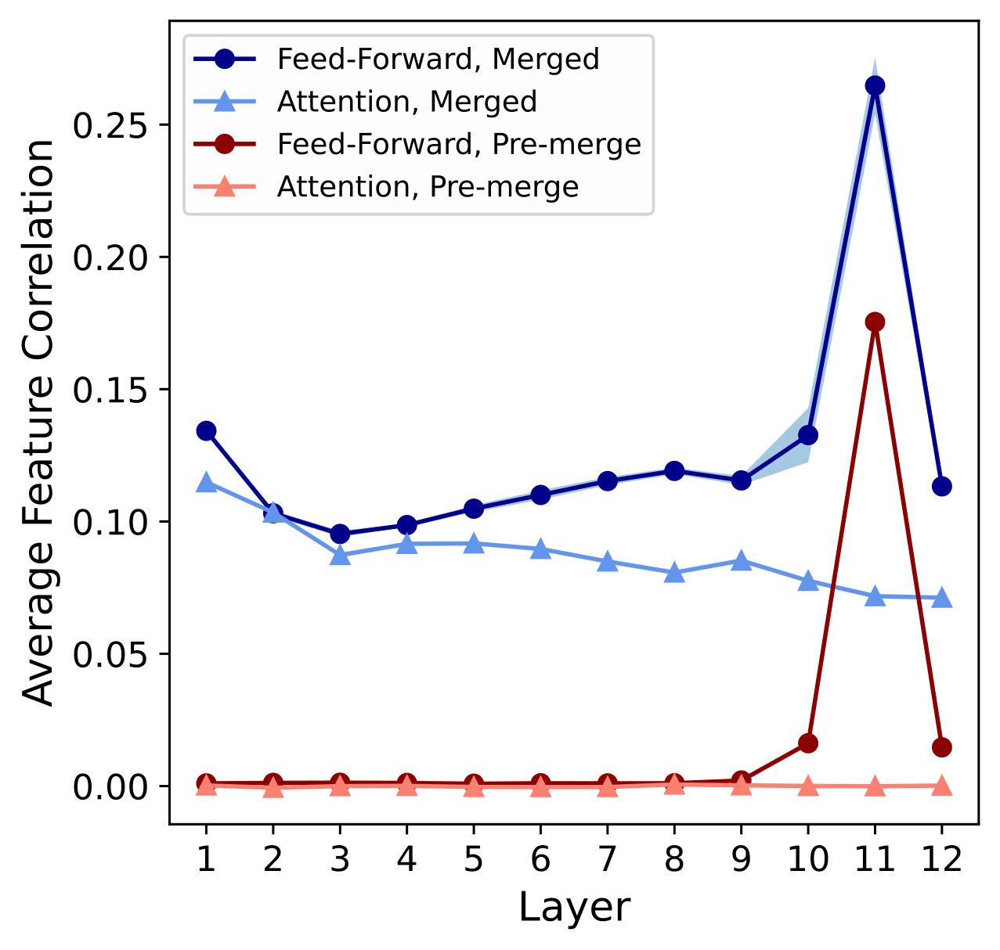
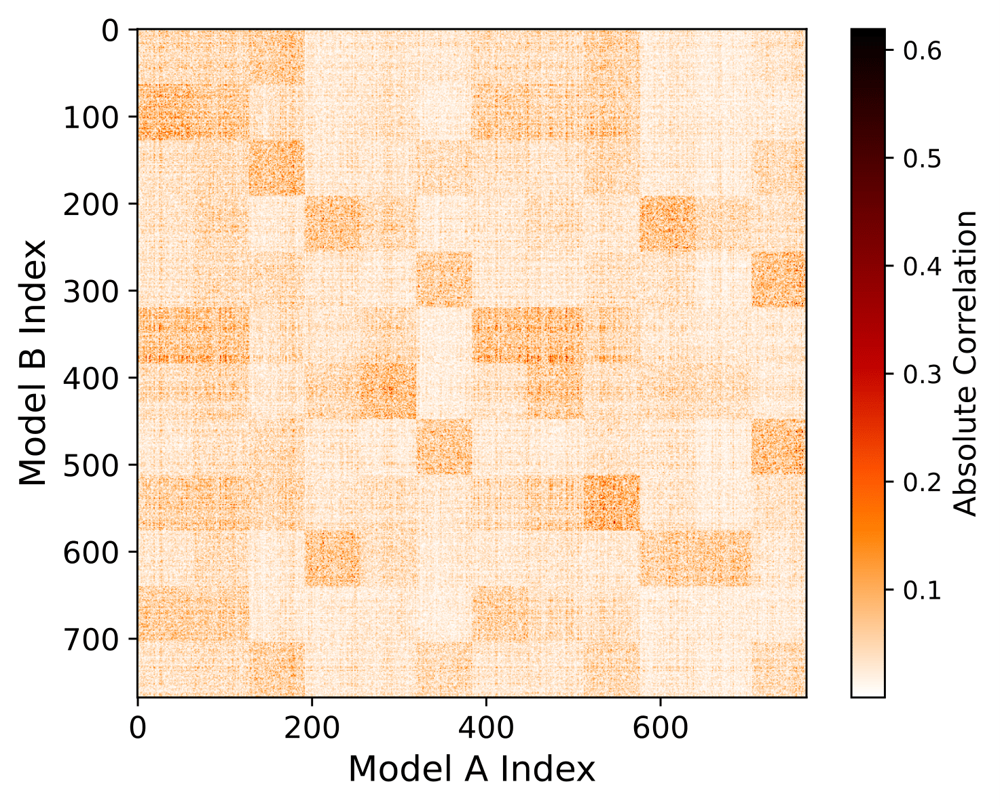
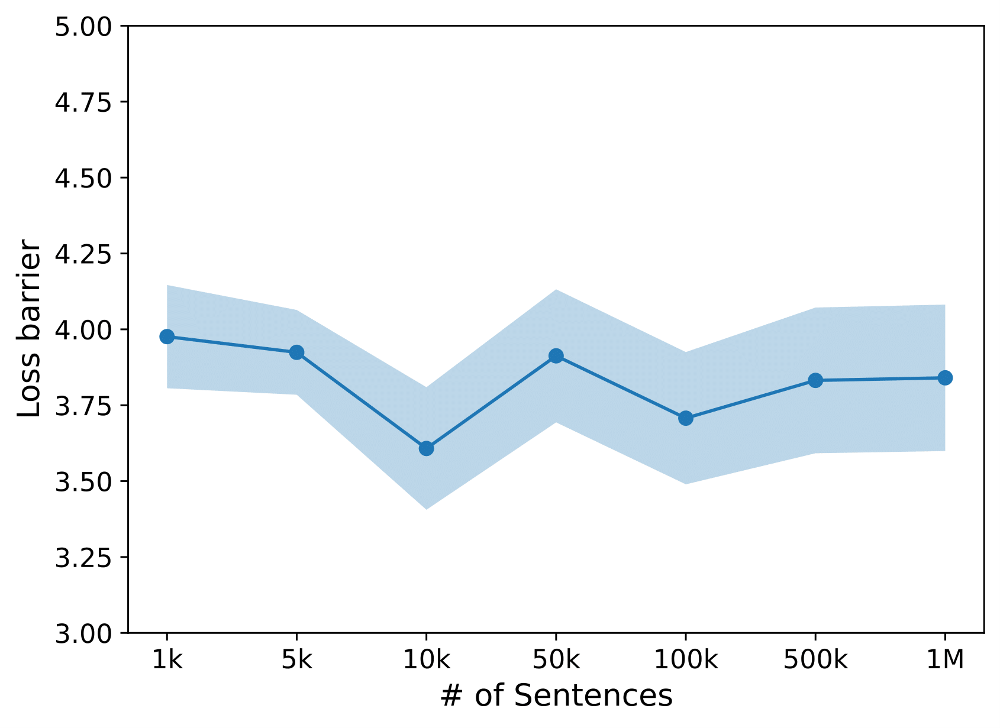
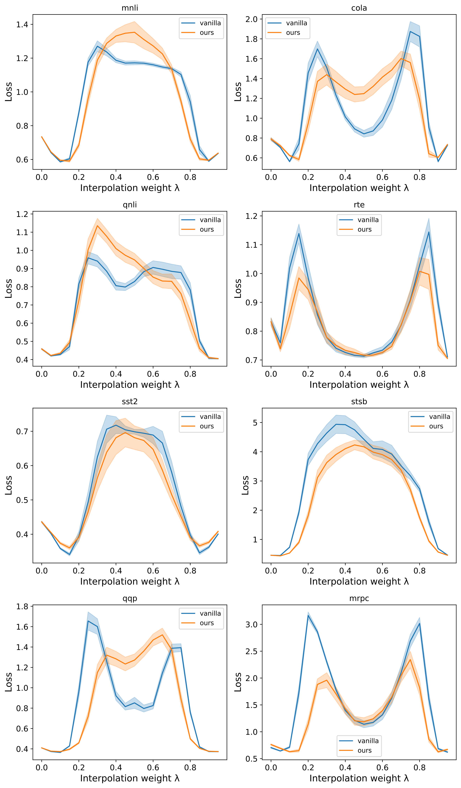

# Merging Text Transformer Models from Different Initializations
*Posted by: Kyungtae Kim, Minwoo Kim*

*Authors: Neha Verma (Johns Hopkins University), Maha Elbayad (Meta)*

[[paper link]](https://arxiv.org/abs/2403.00986).

Although recent works on model merging have exhibited low- or zero-barrier mode connectivity between models with different initialization, model merging on transformer architecture has not yet been studied extensively. The application of previous merging techniques on the transformer structure is limited due to its unique structural characteristics, such as residual connection, multi-head attention (MHA), and sequential input. The paper merges separate transformer minima, proposing a new model merging technique to investigate the relationship between the pre-trained models' minima in the loss landscape. Using permutation-based model merging, authors found lower loss barriers between minima compared to other model merging techniques such as model averaging. The results showed that the model has less sharp and isolated minima than previously expected.

The contributions of the researchers are listed as follows:
1. They introduced a new transformer merging algorithm based on model permutation.
2. They showed that the technique leads to decreased loss barriers between masked language models trained from different initializations compared to other merging methods.
3. They extended their approach to fine-tuned models and showed consistently smaller loss barriers between models compared to vanilla merging.

## Background
### Transformer

    

Figure 1. Basic structure of a transformer.

Transformer is a type of sequence-to-sequence (seq2seq) models that takes a sequence of tokens as an input, and computes according to the input token. Unlike previous seq2seq models where a certain input token had a hard time affecting every output tokens, transformer uses ***self-attention***, which allows all tokens to affect every output tokens. This allows for better performance in data where the distance between tokens has low relationship to the importance of the tokens' importance. For more details on transformers and attention, see the paper ['Attention is All You Need'](https://arxiv.org/abs/1706.03762).

### Loss Landscape
[Loss landscape](https://arxiv.org/abs/1712.09913) is a representation of the loss values around the weight space of the network. Loss landscape helps researchers see how well a neural network has been trained and gives researchers new insights on their models.

    

Figure 2. An example of a loss landscape of a deep learning model.

DNNs are trained by optimizing a loss function with an stochastic gradient descent (SGD) variant. The loss landscapes of these networks have been shown to contain infinitely many global minimizers that are reachable with the help of SGD. One reason for the abundance of minima is **overparameterization**, which leads different functions to behave similarly on the training data. **Permutation and scaling invariances** also lead to functionally identical minima that differ in the weight space. Prior works stated that the optima of loss functions are connected by simple curves over which training and test accuracy are nearly constant (no loss barrier). This is called *mode connectivity*. Other researchers conjectured that if the permutation invariances of neural networks are taken into account, these optima are linearly mode connected, i.e. the linear path connecting these two models has no loss barrier.
In the paper, the authors pay attention on how permutation between models could lead to similar or identical loss landscapes.

### Model Interpolation
Model interpolation is a technique that blends two or more models to create an intermediate model. This process is mostly done by averaging the model weights. Researchers found out that if fine-tuned models lie in a single low error basin, then the weight averaging performs similarly to ensembling, which combines the output of multiple fine-tuned model to hopefully obtain a better result. It is however not guaranteed that fine-tuned models (starting from the same initialization) will reside in the same loss basin. Prior work on linear interpolation-based model merging has focused on improving the algorithms used to bring the hidden units of two networks into alignment, in order to reduce the barrier to interpolation between them.

## Permutation-based Merging
### Feed-Forward Layers
In this section, we explain how the authors of the paper used permutation to find the similarities between two distinct models and merge them. In short, permutation order that maximizes the cross-correlation of the models is calculated and the permutation is used to change the weight ordering.

In more details, given two models \theta_A and \theta_B trained from distinct initializations, the authors compute post-activation features for each layer or sublayer parameter \text{W}_l\subset \theta in order to compute the similar parts across models. The researchers compute d-dimensional activations across n tokens from both models \text{X}_A, \text{X}_B\in \mathbb{R}^{n\times d}. Then, the feature relatedness via cross-correlation is computed as


C=\text{corr}(\text{X}_A, \text{X}_B)=\frac{\mathbb{E}[(\text{X}_A-\boldsymbol{\mu}_{\text{X}_A})^\text{T}(\text{X}_B-\boldsymbol{\mu}_{\text{X}_B})]}{\boldsymbol{\sigma}_{\text{X}_A}\boldsymbol{\sigma}_{\text{X}_B}},


where \boldsymbol{\sigma} is a standard deviation vector, and \boldsymbol{\mu} is a mean vector. The features are standardized since the magnitude of features values can vary greatly depending on the initialization. Next, the permutation that gives the highest correlation score is computed, and is declared as the optimal computation. More specifically, given C\in\mathbb{R}^{d\times d} and a permutation mapping \pi, the optimal permutation is computed as follows:


\text{arg}\max_\pi \sum_{i=1}^{d} C(i, \pi(i)).


cf. The above problem is solved using the Jonker-Volgenant algorithm.

Next, the permutation mapping \pi is converted to a permutation matrix \text{P}. The matrix is then multiplied to the original weight matrix of B denoted as \text{W}_l^B \subset \theta_B. Then the permuted weight matrix \text{P}\text{W}_l^B closely resembles the weight A, denoted as \text{W}_l^A \subset \theta_A. Denoting the modified model parameters as \theta_B', the final merged model is computed as \lambda\theta_A+(1-\lambda)\theta_B for some \lambda\in[0,1].

cf. If permutation matrix \text{P} is multiplied in layer l, then \text{P}^{\text{T}}=\text{P}^{-1} is applied in the next layer to unpermute the ordering, i.e.,


\text{W}_{l+1}^{B'} \leftarrow \text{W}_{l+1}^{B}\text{P}^{\text{T}}.


### Multi-head Attentions

     

Figure 3. Different head alignments occuring from different initialization. Though the 5 heads of the multi-head attention all connect to the same 5 features, the order of the heads may differ.

As aformentioned, multi-head attention mechanism can be challenging to deal with due to its unique properties. The authors propose using permutation on each attention head separately and not permuting features between attention heads.

More specifically, multi-head attention parameters include parameters from key, query, value, and linear layer each denoted as \text{W}_K, \text{W}_Q, \text{W}_V, and \text{W}_O. For each key, query, and value weights, the whole parameter \text{W} \in \mathbb{R}^{d_{\text{model}} \times d_{\text{model}}} is partitioned into H attention heads each of output dimension d_k = d_{\text{model}}/H. Permutation should be operated on each attention head separately, in order to apply a permutation to full weight matrices and maintain the functional equivalence of the overall model. This is because the final hidden vector from MHA reflects a concatenation of the result from each head, which are computed separately with weights \text{W}_{K_i} ,\text{W}_{Q_i} , \text{W}_{V_i} for head i. As can be seen from figure 123, since the models are trained from different initializations, the correspondence of their attention heads may differ in addition to the correspondence of features within each head. The features are extracted just after the attention computation and before the linear layer. The features are used to compute C, and then the correlation matrix is partitioned by heads into d_k \times d_k correlation matrices, for each potential attention head pair. Next, optimal permutation for each unique head pair (j, k) is computed. Each head's internal permutation is computed and stored, and the cost is computed as


\text{cost}(j,k)=\max_\pi \sum_{i=1}^{d_k} C_{jk}(i,\pi(i)),


where C_{jk} refers to the specific partition of the overall correlation matrix. The outer head correspondence permutation is computed as


\pi_{\text{outer}}=\text{arg}\max_\pi \sum_{h=1}^{H} \text{cost}(h,\pi(h)).


    

The algorithm returns a permuting matrix \text{P}_{\text{MHA}}, which is applied to each of \text{W}_V, \text{W}_K and \text{W}_Q.

#### Residual Connections
Each transformer layer comes with two residual connections, as can be seen from Figure 1. The residual connections can be formulated as follows:


\begin{aligned}
x_a^r&=\text{LN}(\text{W}_O \text{MHA}(x) + x),\\
x_f^r&=\text{LN}(\text{W}_2 \text{ReLU}(\text{W}_1 x_a^r) + x_a^r).
\end{aligned}


The input and output of both sublayers are added to create a new output. This implies that if a permutation operation is applied to the output state, the permutation should be the same for both addends. Also, since the inputs passes through the LayerNorm module, the permutation to the output should also permute the features of the LayerNorm module also. Ignoring the parameters of the LayerNorm,


\begin{aligned}
\text{P}x_f^r&=\text{P}(\text{W}_2 \text{ReLU}(\text{W}_1 x_a^r) + x_a^r)\\
&=\text{P}\text{W}_2 \text{ReLU}(\text{W}_1 x_a^r) + \text{P}x_a^r\\
&=\text{P}\text{W}_2 \text{ReLU}(\text{W}_1 x_a^r) + \text{P}(\text{W}_O \text{MHA}(x) + x)
\end{aligned}


Since the input to each layer must be permuted (\text{P}x), and the output of each layer is also permuted (\text{P}x_f^r), the entire transformer architecture uses the same \{\text{P}, \text{P}^{\text{T}}\} matrices for all weights involved in residual connections.

## Models, Tasks, Datasets and Evaluation settings
In this work, the authors investigated 5 different BERT models from the MultiBERTs reproductions seeds 1 through 5 (See ['BERT: Pre-training of Deep Bidirectional Transformers for Language Understanding'](https://aclanthology.org/N19-1423/) & ['The MultiBERTs: BERT Reproductions for Robustness Analysis'](https://arxiv.org/abs/2106.16163)).
Each model has the following properties:
  1. Each model comes from a `bert-base-uncased` checkpoint.
  2. Different random initialization and random ordering.
  3. Same original BERT vocabulary and tokenizer.

To test the baseline method, they used the masked language modeling task while employing the validation set of the [Wikitext-103 benchmark](https://arxiv.org/abs/1609.07843) as the evaluation data. Next, they extracted over one million sentences from the [Books corpus](https://www.cv-foundation.org/openaccess/content_iccv_2015/html/Zhu_Aligning_Books_and_ICCV_2015_paper.html).
In classification tasks, they employed fine-tuned models with randomly initialized classification head with pooling layer and classification layer weights. The authors kept the head initializations the same across the models. They used the General Language Understanding Evaluation ([GLUE](https://arxiv.org/abs/1804.07461)) benchmark excluding [WNLI](https://arxiv.org/abs/1810.04805).
As a baseline for comparison, vanilla averaging is defined as:


\theta_{avg} = \frac{1}{2}(\theta_A+\theta_B)


In this work, they defined new evaluation definitions. They defined loss-barriers as (['M. The lottery ticket hypothesis: Finding sparse, trainable neural networks. In International Conference on Learning Representations'](https://arxiv.org/abs/1803.03635)):

\max_{\lambda} \mathcal{L}(\lambda\theta_A + (1 - \lambda)\theta_B) - \frac{1}{2}(\mathcal{L}(\theta_A) + \mathcal{L}(\theta_B))


A masking probability of p = 0.15 across block sizes of 128 tokens were used to compute MLM loss/pseudo-perplexity. For N masked samples in the text \textbf{W}, pseudo-perplexity is defined as:


\mathrm{Pseudo-PPL}(\textbf{W};\theta) = 2^{-\frac{1}{N} \sum_{i=1}^{N}\log_{2}\,p_\theta(\omega_i|\textbf{W}_{\backslash{i}})}


## Results
### By component
First, they found that the merging all feed-forward sublayers and/or merging all multi-headed attention sublayers reduces the pseudo-perplexity compared to the baseline. Remakably, combination of them leads to the reducuction of the perplexity by about 7 times at \lambda = 0.5 (See Figure 4). The reduced barrier suggests that a lower loss path has formed among these models, indicating a connection between the minima with a barrier similar to what they report.

     

Figure 4. Results of pseudo-perplexity scores of 10 MultiBERTs with vanilla averaging, merging all feed-forward sublayers, and merging all multi-headed attention sublayers and all multi-headed attention sublayers.

Next, they investigated how well these Transformers learn similar representations of the model. The average feature correlations of both the Feed-Forward layer and the attention pre-merged/merged with our method are calculated. The aligned models show higher average feature correlations than the orignal models. However, these values are no more than 0.3 because some pre-trained transformers can be sparsely activated and be pruned heavily leading to lower average feature correlations (Li et al.,2023; Dalvi et al., 2020).

     

Figure 5. Results of average feature correlations between 10 masked language model pairs.

### Multi-headed attention
Next, they investigated loss barrier of Head-Permutation multi-headed attention approach. It is worth noting that this approach maintains head structure while allowing different head correspondences (*Head-Perm*). The proposed method exhibits lower loss barrier than method using simple attention averaging (*Vanilla Attention Avg.*), method that ignores the multiheaded structure of the weight parameters (*Ignore-Heads*), and method that does not allow for different head correspondences across different models (*Monotonic*) while exhibiting clear attention head boundaries of the correlation matrix (See Figure 5 and Table 1).

<table style="border: 2px; margin: auto;">
  <tr>
    <td > Method </td>
    <td class="centered"> Loss Barrier&darr; </td>
    <td class="centered"> Std. Err. </td>
  </tr><tr>
    <td > Vanilla Attention Avg. </td>
    <td class="centered"> 4.31 </td>
    <td class="centered"> 0.21 </td>
   </tr><tr>
    <td > Monotonic Head Alignment </td>
    <td class="centered"> 4.13 </td>
    <td class="centered"> 0.20 </td>
  </tr><tr>
    <td > Ignore-Heads </td>
    <td class="centered"> 3.97 </td>
    <td class="centered"> 0.25 </td>
  </tr><tr>
    <td > Head-Perm </td>
    <td class="centered"> <b>3.71 </b></td>
    <td class="centered"> 0.23 </td>
</table>

Table 1. Loss Barriers of 10 MultiBERTs merged with feed-forward and attention components merged.

     

Figure 6. Results of a correlation matrix between the first multi-headed attention layer from two different MultiBERTs models.

### Residual Stream
Next, the effect of the permutation alignment involving residual connection parameters is discussed. Repeated Add/Norm components sharing the permutation operations reduce the permutation symmetries and available residual stream parameters. The identity permutation which uses the identity matrix {I_d} exhibits the lowest loss barrier because only one pair of {\{P, P^T\}} is in the residual stream. We note that the seperate permutation approach, despite it having the largest loss barrier and no valid symmetry, has largest degrees of freedom.

<table style="border: 2px;" align="center">
  <tr>
    <td > Method </td>
    <td class="centered"> Loss Barrier&darr; </td>
    <td class="centered"> Std. Err. </td>
  </tr><tr>
    <td > Identity </td>
    <td class="centered"> <b>4.95 </b></td>
    <td class="centered"> 0.38 </td>
   </tr><tr>
    <td > First </td>
    <td class="centered"> 7.58 </td>
    <td class="centered"> 0.19 </td>
  </tr><tr>
    <td > Last </td>
    <td class="centered"> 7.41 </td>
    <td class="centered"> 0.18 </td>
</tr><tr>
    <td > All </td>
    <td class="centered"> 7.34 </td>
    <td class="centered"> 0.22 </td>
  </tr><tr>
    <td > Seperate </td>
    <td class="centered"> 9.38 </td>
    <td class="centered"> 0.49 </td>
</table>

Table 2. Loss Barriers of merged MultiBERTs with only residual components merged.

### Amount of Data
Moreover, they investigate the effect of the amount of sentences on the loss barrier. Despite the combination of feed-forward and attention layers, there is no strong directional relationship between the amount of data and the loss barrier. It seems that some variations are attributed by the quality of the data (See Figure 7). 

     

Figure 7. Results of loss barrier respect to the amount of sentences.

### GLUE results
Finally, they compared the loss barriers of their method to those of vanilla averaging approach for eight different GLUE tasks including residual permutations (See Figure 8 and Table 3). Vanilla averaging (STS-B) exhibits the highest loss, but some tasks show that the vanilla averaging outperforms their approach. They observe inconsistent loss reduction, with lower loss barriers than those of the masked language modeling setting. They also observe that lower loss pattern than either parent model at about \lambda = 0.15 and \lambda = 0.85. Interestingly,  M-shaped curve can be found in some vanilla merges between these fine-tuned models. In this perspective, their method could be extended to explore lower loss paths between finely-tuned minima. However, the selection of optimal data for the lowest loss, understanding of fine-tuned models and pre-connectivity in the loss landscape are remained for future work.

     

Figure 8. Loss barrier curves for 8 GLUE tasks for vanilla interpolation and our strategy.

<table style="border: 2px;" align="center">  <tr>
    <td>    </td>
    <td colspan="2"> Vanilla averaging </td>
    <td colspan="2"> Proposed </td>
  </tr><tr>
    <td >  </td>
    <td > Barrier </td>
    <td > Error </td>
    <td > Barrier </td>
    <td > Error </td>
  </tr><tr>
    <td > MNLI-mm </td>
    <td > <b>0.61 </b></td>
    <td > 0.03 </td>
    <td > 0.72 </td>
    <td > 0.08 </td>
   </tr><tr>
    <td > QQP </td>
    <td > 1.37 </td>
    <td > 0.09 </td>
    <td ><b> 1.20</b> </td>
    <td > 0.11 </td>
  </tr><tr>
    <td > QNLI </td>
    <td > <b>0.64</b> </td>
    <td > 0.04 </td>
    <td > 0.77 </td>
    <td > 0.06 </td>    
  </tr><tr>
    <td > SST-2 </td>
    <td > 0.42 </td>
    <td > 0.04 </td>
    <td > <b>0.36</b> </td>
    <td > 0.07 </td>    
  </tr><tr>
    <td > CoLA </td>
    <td > 1.31 </td>
    <td > 0.14 </td>
    <td > <b>1.11</b> </td>
    <td > 0.13 </td>    
  </tr><tr>
    <td > STS-B </td>
    <td > 5.15 </td>
    <td > 0.44 </td>
    <td > <b>4.24</b> </td>
    <td > 0.35 </td>   
  </tr><tr>
    <td > MRPC </td>
    <td > 2.74 </td>
    <td > 0.08 </td>
    <td > <b>1.93</b> </td>
    <td > 0.11 </td>   
  </tr><tr>
    <td > RTE </td>
    <td > 0.53 </td>
    <td > 0.04 </td>
    <td > <b>0.41</b> </td>
    <td > 0.05 </td> 
</table>

Table 3. Comparison of loss bariers between fine-tuned BERT model across 8 GLUE tasks for vanilla interpolation and our strategy.

## Conclusion

In this work, the authors develop a new strategy for model mergring based on permutation mapping and demonstrates reduced loss barriers between masked languaged models with different initialziation compared to vanilla merging. Next, they extend their approach to fine-tuned models. The authors suggest that understanding the connectedness between models lead to achieving sharpness of minima and smoothness Transformer loss space. Moreover, it can open up new possibilities for improving design optimization methods, ensembles of models, and additional merging techniques. Specifically, this paper shows that permutation invariances of Transformer model is considered to characterize the geometric features of minima. Finally, they shad the light on the relationships between fine-tuned models, Transformer width and loss barriers, and the data for characterize the relationship between Transformer minima.

Further research is possible, examining the proposed techniques on a more complicated or larger dataset. Also, more sophisticated inspection on the aformentioned M-shaped loss curve is needed.

## References
Paper: https://arxiv.org/abs/2403.00986

Attention mechanism: https://arxiv.org/abs/1706.03762

Loss landscape explanation:  https://arxiv.org/abs/1712.09913

BERT: https://aclanthology.org/N19-1423/

MultiBERTs: https://arxiv.org/abs/2106.16163

Wikitext-103 benchmark: https://arxiv.org/abs/1609.07843

Books corpus: https://www.cv-foundation.org/openaccess/content_iccv_2015/html/Zhu_Aligning_Books_and_ICCV_2015_paper.html

GLUE: https://arxiv.org/abs/1804.07461

WNLI: https://arxiv.org/abs/1810.04805

Loss barrier: https://arxiv.org/abs/1803.0363
